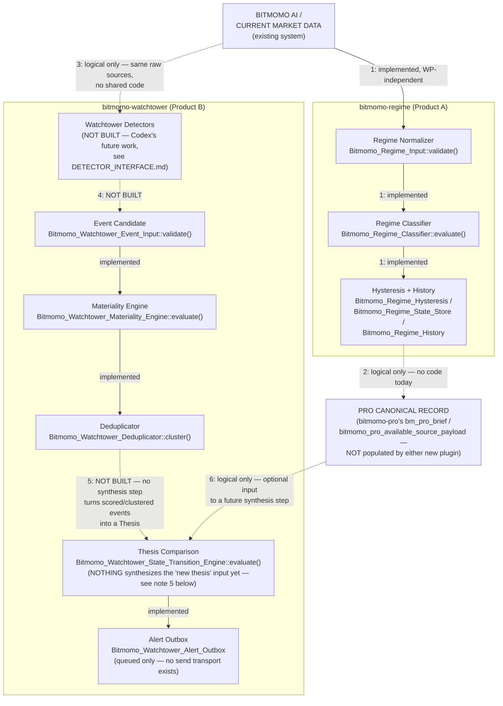

# Bitmomo Intelligence Products — Runtime Dataflow

**Scope:** the logical dataflow across Product A (`bitmomo-regime`) and Product B
(`bitmomo-watchtower`), from raw market data through to an eventual alert, produced for the
Integration Hardening Phase. This is a **logical** diagram, not an architecture that exists in
code today — every arrow is annotated below with whether it is (a) an already-implemented,
already-tested call inside one plugin, (b) a not-yet-built runtime step that is explicitly
Codex's work, or (c) a purely data-level relationship with **no code dependency whatsoever**
between the two new plugins, or between either new plugin and `bitmomo-pro`/`bitmomo-ai`.

Per the brief that requested this document: this diagram shows relationships **without
adding direct plugin dependencies**. Nothing described here changes any `require`, any class
reference, or any coupling between `bitmomo-regime`, `bitmomo-watchtower`, `bitmomo-pro`, and
`bitmomo-ai` — all four remain exactly as isolated as they were before this document existed.

## The diagram

## Legend: implemented vs. logical vs. not built

Every arrow above is one of exactly three kinds. This is the load-bearing part of the
document — the diagram alone can't distinguish "this works today" from "this is aspirational."

- **Implemented, tested, real code** (solid arrows, "N: implemented"): the source class
  literally calls the destination class/method, and there is a passing deterministic test
  covering it.
- **Logical / data-level relationship, no code** (dotted arrows, "logical only"): describes
  how the *concepts* relate, or how Codex's runtime *could* wire real data between systems —
  but no `require`, class reference, or function call exists anywhere in either plugin today.
- **Not built** (dotted arrows, "NOT BUILT"): a step the overall product needs eventually,
  explicitly out of scope for this engineering phase, and explicitly Codex's (or a future
  PR's) responsibility.

## Walking the diagram, arrow by arrow

1. **Bitmomo AI / current market data → Regime Normalizer.** *Implemented, WP-independent.*
   `Bitmomo_Regime_Input::validate()` is a pure function — it has no idea where its input
   array came from. Codex's runtime adapter is what will actually read from Bitmomo AI /
   current market data and shape it into this contract (see
   `bitmomo-regime/CODEX_INTEGRATION_CONTRACT.md` and this PR's `FIELD_SEMANTICS.md`); no
   such adapter exists yet.
2. **Regime Normalizer → Regime Classifier → Hysteresis/History.** *Implemented.* This whole
   chain (`Bitmomo_Regime_Input::validate()` → `Bitmomo_Regime_Classifier::evaluate()` →
   `Bitmomo_Regime_Hysteresis` → `Bitmomo_Regime_State_Store`/`Bitmomo_Regime_History`) is
   real, tested code (87 assertions pre-existing, plus this PR's fixture/adapter-contract
   tests). It only needs a scheduled caller and a real data feed — see
   `bitmomo-regime/CODEX_INTEGRATION_CONTRACT.md`.
3. **Hysteresis/History → "Pro Canonical Record."** *Logical only — no code today.*
   `bitmomo-regime` has no dependency on `bitmomo-pro` and never writes anywhere `bitmomo-pro`
   reads from. If Codex's runtime eventually decides Regime's classified output (regime,
   confidence, evidence) should inform what a human editor later fills into a `bm_pro_brief`
   (see `CANONICAL_FIELD_MAPPING.md` for why `bm_pro_brief` has no `regime` field today), that
   is a data-level, human- or Codex-adapter-mediated choice — never a code dependency from
   `bitmomo-regime` into `bitmomo-pro`.
4. **Bitmomo AI / current market data → Watchtower Detectors.** *Logical only.* Watchtower's
   eventual detectors would read from the same category of upstream sources Regime does (and
   potentially others — exchange APIs, news, macro calendars; see
   `DETECTOR_INTERFACE.md`'s explicit non-goals: no polling/Binance/news code exists in this
   plugin). There is no shared code between the two plugins' data ingestion — each would build
   (or Codex would build) its own adapter.
5. **Watchtower Detectors → Event Candidate.** *NOT BUILT.* No detector class exists anywhere
   in `bitmomo-watchtower`. `DETECTOR_INTERFACE.md` (this PR) documents the conceptual
   interface a future detector must satisfy; `Bitmomo_Watchtower_Event_Input::validate()` is
   the real, already-tested enforcement point a detector's output must pass through.
6. **Event Candidate → Materiality → Dedup.** *Implemented.* This chain
   (`Bitmomo_Watchtower_Event_Input::validate()` → `Bitmomo_Watchtower_Materiality_Engine::
   evaluate()` → `Bitmomo_Watchtower_Deduplicator::cluster()`) is real, tested code — see the
   Task 4 fixtures (`tests/fixtures/watchtower-*.json`) for six worked examples running this
   exact chain end to end.
7. **Dedup → Thesis Comparison.** *NOT BUILT — the single biggest gap in this whole diagram.*
   Nothing in `bitmomo-watchtower` turns a cluster of scored event candidates into a new
   candidate `Bitmomo_Watchtower_Thesis`. `Bitmomo_Watchtower_State_Transition_Engine::
   evaluate()` only ever compares two *already-built* theses — see every Task 4 fixture's
   `illustrative_transition` block and its notes for a concrete demonstration of this gap, and
   `CANONICAL_FIELD_MAPPING.md` note 7 for how the comparison's own output
   (`transition.reason`/`transition.diff`) already covers most of what a synthesis step's
   "what changed" narrative would need, once that step exists.
8. **"Pro Canonical Record" → Thesis Comparison.** *Logical only.* If Codex's future
   synthesis step wants to ground a new Watchtower thesis in whatever `bitmomo-pro` currently
   holds as its canonical read (`market_state`, `confidence`, etc. — see
   `CANONICAL_FIELD_MAPPING.md`), that is an input choice for that future synthesis step to
   make, not a dependency `bitmomo-watchtower`'s code has today or should gain implicitly.
9. **Thesis Comparison → Alert Outbox.** *Implemented.* `Bitmomo_Watchtower_Orchestrator::
   process()` already wires `Bitmomo_Watchtower_State_Transition_Engine::evaluate()` →
   `Bitmomo_Watchtower_Alert_Policy::evaluate()` → `Bitmomo_Watchtower_Analyst_Router::
   route()` → `Bitmomo_Watchtower_Alert_Outbox::enqueue()`, fully tested. The outbox only
   ever reaches `queued` status — nothing sends anything anywhere (no Telegram, no email, no
   webhook exists in this plugin). See `ALERT_POLICY_SAFETY_REVIEW.md` for what governs
   whether a given transition actually reaches the outbox.

## The one-sentence summary

Everything **within** each plugin's existing pipeline (arrows 2 and 6) is real, tested,
deterministic code today. Everything **between** systems — Bitmomo AI into either plugin,
either plugin into `bitmomo-pro`, and critically, Watchtower's own event-scoring output into
a new Thesis — is either a documented contract with no adapter behind it yet, or explicitly
unbuilt. This diagram exists so Codex can see the whole shape of the eventual system at a
glance without mistaking a logical relationship for a working code path.
